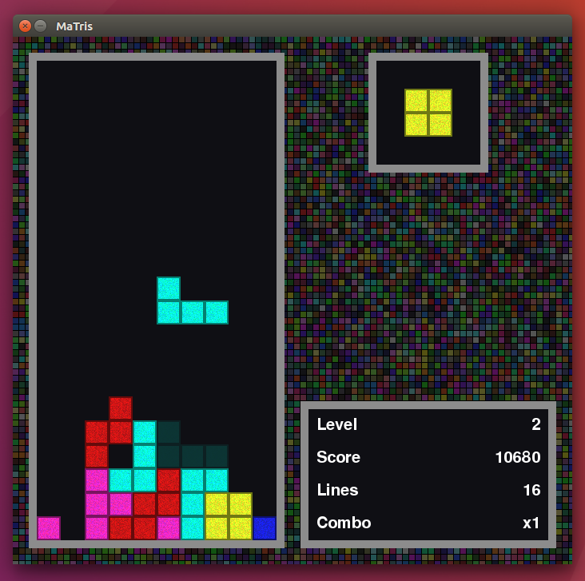

MaTris
======

A clone of Tetris made using Pygame. Licensed under the GNU GPLv3. Works with both Python 2 and 3.

Run `python matris.py` (or `python3 matris.py`) to start the game.

Requirements
============

The game requires [pygame](https://www.pygame.org). On Ubuntu it can be installed with these commands: `sudo apt install python-pip && sudo pip install pygame` (for Python 2) `sudo apt install python3-pip && sudo pip3 install pygame` (for Python 3).

Demo
====

Coveted by academia
========================
In 2013, my game [was used](http://eprints.ucm.es/22631/1/REMIRTA.pdf) by someone in Madrid to test "remote execution of multimedia interactive real-time applications". The next year, [a study in Denmark](https://www.academia.edu/6262472/Improving_game_experience_using_dynamic_difficulty_adjustment_based_on_physiological_signals) called "Improving game experience using dynamic difficulty adjustment" asked participants to "self-rate their valence and arousal [sic]" playing MaTris! Who would've thunk it? In 2016, people in Stanford [were using the game](http://cs231n.stanford.edu/reports/2016/pdfs/121_Report.pdf) to try out deep reinforcement learning, although apparently the result was not as "respectable" as it could've been. Not a problem in Korea, apparently, where students [are expected](http://nlp.chonbuk.ac.kr/AML/AML_assignment_2.pdf) to accomplish it! That stuff is way above my head, but perhaps my life will be spared during the singularity?
